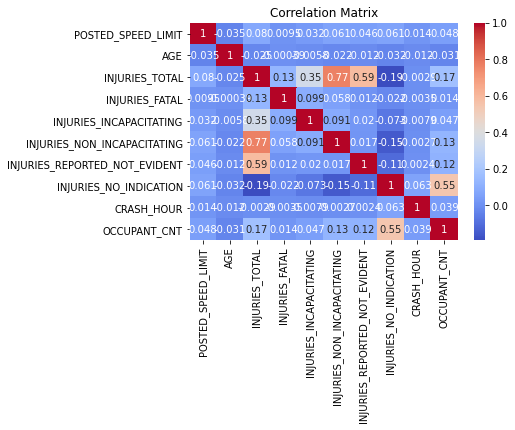

# Group7_Phase4_Project

## Overview

This project analyzes Chicago road traffic crash data to identify key risk factors, temporal patterns, and the impact of preventive measures on crash severity and frequency. The analysis leverages three datasets: crashes, people, and vehicles, merged for comprehensive insights.

## Objectives

1. Identify and analyze key risk factors contributing to crash severity.
2. Examine temporal and situational patterns in crash and injury severity.
3. Evaluate the impact of preventive measures on crash outcomes.

## Data Sources

- [Traffic Crashes - Crashes](https://data.cityofchicago.org/Transportation/Traffic-Crashes-Crashes/85ca-t3if/about_data)
- [Traffic Crashes - People](https://data.cityofchicago.org/Transportation/Traffic-Crashes-People/u6pd-qa9d/about_data)
- [Traffic Crashes - Vehicles](https://data.cityofchicago.org/Transportation/Traffic-Crashes-Vehicles/68nd-jvt3/about_data)

## Data Preprocessing

- Missing values are inspected and visualized using heatmaps and bar graphs.
- Data cleaning is performed to handle missing values and outliers.

## Exploratory Data Analysis (EDA)

### Sample Visualizations

### Insights

- Most crashes result in minor injuries; severe injuries are rare.
- Safety belts are highly effective in reducing injury severity.
- Severe injuries cluster at higher speed limits and in adverse weather conditions.
- Crash frequency peaks during rush hours and weekdays.
- Males and SUVs show slightly higher proportions of severe injuries.

## Modelling

- Predictive models (Logistic Regression, Decision Tree, Random Forest) are built using a pipeline with preprocessing (scaling, PCA, one-hot encoding).
- Grid search is used for hyperparameter tuning.
- Model performance is compared using accuracy, F1 score, and confusion matrices.
- Severe class imbalance is observed; minority classes are poorly predicted.

## Model Interpretability

- LIME is used to explain individual predictions of the best-performing model (Random Forest).
- LIME visualizations help understand feature contributions to predictions.

## Recommendations

- Use stacked bar charts and countplots for categorical comparisons.
- Use boxplots and heatmaps for numeric and correlation analysis.
- Address class imbalance for improved minority class detection (e.g., SMOTE).
- Use LIME for model interpretability in presentations.

## Usage

1. Run `index.ipynb` for full analysis and visualization.
2. Data preprocessing and cleaning are handled by [`CrashDataProcessor`](utils.py).
3. Visualizations are generated using Seaborn and Matplotlib.
4. Model training and evaluation are performed in the notebook.

## License

MIT License. See [LICENSE](LICENSE) for details.